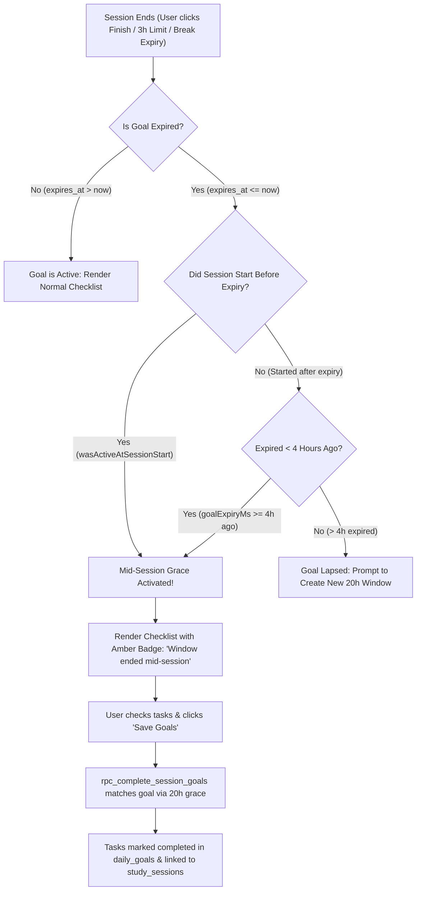

# 20-Hour Rolling Goals Architecture & Migration Guide

> **Document Status**: Production Migration Reference & Problem-Solving Guide  
> **Target File**: `20hour goals_update.md`  
> **Scope**: Architecture, research, deep keyword audit, mid-session expiry mechanics, task deduplication, backwards compatibility, and step-by-step implementation for migrating rolling goals from **24 Hours (1,440 minutes / 86,400 seconds)** to **20 Hours (1,200 minutes / 72,000 seconds)**.  
> *(Note: Sunday–Monday weekly reset and leaderboard transition issues are documented separately in `BUG_FIX_PENDING.md`)*.

---

## 1. Architectural & Psychological Rationale for 20 Hours

### The Problem with 24-Hour Windows
In a strict 24-hour rolling goal system:
1. **Clock Drift Lockout**: If a student sets their goals on Monday at 6:00 PM, the goal set remains locked until Tuesday at 6:00 PM. If the student sits down to study on Tuesday at 4:00 PM (2 hours earlier), they cannot create a fresh goal set for their new study session. They are stuck in yesterday's expiring window.
2. **Sleep & Routine Variability**: Student sleep schedules and daily commitments fluctuate by 2–4 hours. A 24-hour cycle forces artificial friction and timing anxiety.
3. **End-of-Day Abandonment**: If a student sets goals late in the evening, yesterday's uncompleted tasks linger well into prime study hours the next afternoon.

### Why 20 Hours ($72,000\text{ seconds}$ / $1,200\text{ minutes}$)?
- **Flexible Daily Cycle**: A 20-hour window provides a natural 4-hour daily leeway. A student who begins studying at 7:00 PM can comfortably set new goals anytime from 3:00 PM onwards the next day.
- **Continuous Rolling Accountability**: Unlike fixed midnight resets where goals disappear abruptly at 00:00 regardless of when the student started, the 20-hour rolling window gives every user their own dedicated, uninterrupted personal commitment block.
- **Append-Only Integrity**: Once committed, goal tasks cannot be deleted or modified (preserving anti-procrastination rigor), but new tasks can be appended dynamically within the 20 hours.

---

## 2. Deep Keyword Audit: Goal vs. Non-Goal Codebase Occurrences

During the migration audit, every single occurrence of time-related constants and terms across the entire project was analyzed to guarantee zero false positives and zero missed goal locations.

### A. Search Keywords Used
`"24h"`, `"24-hour"`, `"24 hours"`, `"24 * 60"`, `"86400"`, `"86,400"`, `"1440"`, `"1,440"`, `"INTERVAL '24 hours'"`, `"daily_goals"`, `"expires_at"`.

### B. Goal-Related Occurrences (Migrated to 20 Hours)
All of the following locations define or reference the goal window lifespan and were migrated:
1. **Database Schema**: `daily_goals.expires_at DEFAULT (NOW() + INTERVAL '20 hours')` in `supabase/schema.sql`.
2. **Creation RPC**: `rpc_create_daily_goal` computing `v_now + INTERVAL '20 hours'`.
3. **Append RPC**: `rpc_add_goal_tasks` verifying active window and error text.
4. **Session Completion RPCs**: `rpc_complete_session_goals` and `rpc_record_break_expiry_goals` grace lookup (`INTERVAL '20 hours'`).
5. **Optimistic Client Timestamp**: `hooks/useDailyGoals.ts` (`20 * 60 * 60 * 1000`).
6. **Countdown Ceiling**: `lib/time/countdown.ts` clamped at `72000` seconds ($20 \times 3600$).
7. **Validation Schema**: `lib/validation/schemas.ts` limit message (`"Maximum 10 tasks allowed per 20-hour window"`).
8. **Offline Queue Sync**: `lib/offline/sessionQueue.ts` error handler recognizing both 20-hour and legacy 24-hour error strings.
9. **UI Badges & Copy**: Modals and cards across `app/goals/`, `components/goals/`, `components/session/`, and `components/guide/`.

### C. Legitimate Non-Goal Occurrences (Intentionally Preserved at 24 Hours)
The following features use 24-hour units for general timekeeping and must **NEVER** be changed to 20 hours:
1. **Rolling Past 24h Study Time**:
   - Files: `hooks/useLiveRoom.ts:169-266`, `lib/supabase/types.ts:16` (`past_24h_study_seconds`).
   - *Reason*: Measures actual physical study volume over the rolling 24-hour clock day for live room cards.
2. **Streak Calendar Day Math**:
   - File: `lib/scoring/streak.ts:109` (`24 * 60 * 60 * 1000`).
   - *Reason*: Standard Earth day arithmetic for stepping backward day-by-day across calendar dates.
3. **Peak Room Traffic Heatmap**:
   - File: `lib/time/traffic.ts:42` (hours `0..23`).
   - *Reason*: Standard 24-hour astronomical clock hours for room peak traffic aggregation.
4. **Zombie Session Safety Purge**:
   - File: `hooks/useActiveSession.ts:230` (`24 * 3600 * 1000`).
   - *Reason*: Safety guard that force-aborts sessions abandoned for $>24$ hours without user interaction.
5. **General Offline Duration Formatter**:
   - File: `lib/time/format.ts` / `tests/unit/time.test.ts` (`"Offline for 24 hours (~1 day)"`).
   - *Reason*: Human-readable time-ago formatting.

---

## 3. Mid-Session Goal Expiration Architecture & Grace Engine

### The Problem
What happens if a student sets a 20-hour goal, and hours later starts a 2-hour study session with only 15 minutes remaining on the goal window?
- While studying, the clock passes the goal's `expires_at` timestamp.
- If the system strictly checked `expires_at > NOW()`, then at the end of the session:
  1. The student's goals would vanish.
  2. The completion modal would show "No active goals found".
  3. The student would be unable to check off the goals they spent the session completing.
  4. The completed tasks would fail to link to the session or the leaderboard.

### The Solution: Multi-Tier Mid-Session Grace System
The platform implements a three-tier grace mechanism across database and frontend:



#### Key Implementation Details:
1. **Client Grace Eligibility ([`hooks/useDailyGoals.ts:125-135`](file:///home/thoughtful/Downloads/group%20study/hooks/useDailyGoals.ts#L125-L135))**:
   ```typescript
   const fourHoursAgoMs = serverNow.getTime() - 4 * 3600 * 1000;
   const goalExpiryMs = new Date(goal.expires_at).getTime();
   const wasActiveAtSessionStart = Boolean(
     sessionStartTime && goalExpiryMs >= new Date(sessionStartTime).getTime()
   );
   const isEligibleSessionGrace =
     isSessionActive && (wasActiveAtSessionStart || goalExpiryMs >= fourHoursAgoMs);
   ```
2. **Session Preservation Flag ([`app/room/page.tsx:87-92`](file:///home/thoughtful/Downloads/group%20study/app/room/page.tsx#L87-L92))**:
   `isSessionActive` remains `true` not only while studying or on break, but also while `isGoalUpdateModalOpen` is `true` or while `pendingGoalSessionId` is non-null.
3. **Database Grace Window in RPCs**:
   In both `rpc_complete_session_goals` and `rpc_record_break_expiry_goals`:
   ```sql
   WHERE user_id = v_user_id
     AND (
       expires_at > v_now
       OR (v_session_start IS NOT NULL AND expires_at >= v_session_start)
       OR expires_at >= (v_now - INTERVAL '20 hours')
     )
   ```
4. **Visual Indicator**:
   When a goal is displayed via grace, `SessionGoalUpdateModal` displays an amber pill:
   `[Window ended mid-session]`.

---

## 4. Task ID Collision & Duplicate Prevention Architecture

### The Problem Encountered
During rapid testing or multi-tab usage, task objects inside `daily_goals.tasks` occasionally produced duplicate React keys:
`Encountered two children with the same key, task-1789647748357-0`.
If two tasks share an ID, toggling one checks both, and deletion/completion state corrupts.

### The Solution: Cryptographic Entropy + Three-Tier Deduplication

1. **Cryptographically Unique Task IDs ([`hooks/useDailyGoals.ts:53-59`](file:///home/thoughtful/Downloads/group%20study/hooks/useDailyGoals.ts#L53-L59))**:
   Instead of just `task-${Date.now()}-${idx}`, IDs now append a cryptographic slice:
   ```typescript
   export function generateGoalTaskId(idx: number): string {
     const randomPart =
       typeof crypto !== "undefined" && typeof crypto.randomUUID === "function"
         ? crypto.randomUUID().slice(0, 8)
         : Math.random().toString(36).substring(2, 10);
     return `task-${Date.now()}-${idx}-${randomPart}`;
   }
   ```
2. **Order-Preserving Deduplication Engine ([`hooks/useDailyGoals.ts:27-48`](file:///home/thoughtful/Downloads/group%20study/hooks/useDailyGoals.ts#L27-L48))**:
   `deduplicateGoalTasks()` deduplicates tasks by ID while strictly preserving order. If duplicate IDs exist with conflicting completion states, it merges them so `completed: true` wins.
3. **PostgreSQL RPC Deduplication ([`supabase/schema.sql:1000-1018`](file:///home/thoughtful/Downloads/group%20study/supabase/schema.sql#L1000-L1018))**:
   `rpc_add_goal_tasks` uses `DISTINCT ON (elem->>'id')` and checks `WHERE NOT EXISTS` against existing tasks to guarantee database-level uniqueness on append.
4. **Self-Healing Client Hook**:
   If `useDailyGoals` loads a legacy database row that contains duplicate tasks, it sanitizes the state in memory and asynchronously executes an update back to Supabase to repair the row permanently.

---

## 5. Complete File-by-File Catalog of Changes

### A. Database Schema & RPCs

#### 1. Table Default
- **File**: `supabase/schema.sql` (Line 130)
- **Change**:
  ```sql
  -- OLD:
  expires_at TIMESTAMPTZ NOT NULL DEFAULT (NOW() + INTERVAL '24 hours')
  -- NEW:
  expires_at TIMESTAMPTZ NOT NULL DEFAULT (NOW() + INTERVAL '20 hours')
  ```

#### 2. `rpc_create_daily_goal`
- **File**: `supabase/schema.sql` (Lines 932, 956)
- **Change**:
  ```sql
  -- OLD:
  v_expires TIMESTAMPTZ := v_now + INTERVAL '24 hours';
  ...
  'message', 'Active 24-hour goal set already exists for this user'

  -- NEW:
  v_expires TIMESTAMPTZ := v_now + INTERVAL '20 hours';
  ...
  'message', 'Active 20-hour goal set already exists for this user'
  ```

#### 3. `rpc_add_goal_tasks`
- **File**: `supabase/schema.sql` (Lines 978, 1009)
- **Change**:
  ```sql
  -- OLD:
  RAISE EXCEPTION 'No active 24-hour goal set found to add tasks to';
  -- NEW:
  RAISE EXCEPTION 'No active 20-hour goal set found to add tasks to';
  ```

#### 4. `rpc_complete_session_goals`
- **File**: `supabase/schema.sql` (Line 1928)
- **Change**:
  ```sql
  -- OLD:
  OR expires_at >= (v_now - INTERVAL '24 hours')
  -- NEW:
  OR expires_at >= (v_now - INTERVAL '20 hours')
  ```

#### 5. `rpc_record_break_expiry_goals`
- **File**: `supabase/schema.sql` (Line 2032)
- **Change**:
  ```sql
  -- OLD:
  OR expires_at >= (v_now - INTERVAL '24 hours')
  -- NEW:
  OR expires_at >= (v_now - INTERVAL '20 hours')
  ```

---

### B. Client Engine, Validation & Time Utilities

#### 1. `hooks/useDailyGoals.ts`
- **Line 280**:
  ```typescript
  // OLD:
  const expiresAt = new Date(now.getTime() + 24 * 60 * 60 * 1000).toISOString();
  // NEW:
  const expiresAt = new Date(now.getTime() + 20 * 60 * 60 * 1000).toISOString();
  ```

#### 2. `lib/time/countdown.ts`
- **Lines 10, 27**:
  ```typescript
  // OLD:
  const clampedSeconds = Math.max(0, Math.min(86400, rawSeconds));
  // NEW:
  const clampedSeconds = Math.max(0, Math.min(72000, rawSeconds));
  ```
  *(72,000 seconds = 20 hours $\times$ 3,600)*.

#### 3. `lib/offline/sessionQueue.ts`
- **Line 663**:
  ```typescript
  // Backwards-compatible queue error handling:
  if (
    msg.includes("no active 20-hour goal set") ||
    msg.includes("no active 24-hour goal set") ||
    (msg.includes("no active") && msg.includes("goal set"))
  )
  ```

#### 4. `lib/validation/schemas.ts`
- **Line 78**:
  ```typescript
  // OLD:
  .max(10, "Maximum 10 tasks allowed per 24-hour window")
  // NEW:
  .max(10, "Maximum 10 tasks allowed per 20-hour window")
  ```

---

### C. User Interface Pages & Modals

| File | Exact Elements Updated |
| :--- | :--- |
| `app/goals/page.tsx` | Header Title: `"Rolling 20-Hour Goals"`, Subtitle: `"Continuous 20h commitment (Append-only)"`. |
| `components/goals/GoalWindowCard.tsx` | Empty State: `"No Active 20-Hour Goal Set"`, Button: `"Start 20-Hour Goal Set"`, Badge: `"20h Window"`, Inline: `"Add Goal to 20h Window"`. |
| `components/goals/CreateGoalModal.tsx` | Title: `"Create 20-Hour Goal Window"`, Explanation: `"Goals expire exactly 20 hours after creation."`, Submit: `"Lock & Start 20h Window"`. |
| `components/goals/AddGoalModal.tsx` | Title: `"Add Goals to 20-Hour Window"`, Warning: `"...when the 20-hour window expires, they count against your weekly Leaderboard..."`. |
| `components/goals/GoalsGuideModal.tsx` | Title: `"Rolling 20-Hour Goals Guide"`, Duration text: `"expires after 1,200 minutes (20 hours)"`, Section: `"1. Continuous 20-Hour Windows"`. |
| `components/guide/FeatureGuideCards.tsx` | Step 1 & 4 cards, Feature 2 card, Split bar (`30% 20h Goals`), Leaderboard component description. |
| `app/guide/page.tsx` | Welcome banner updated to `"rolling 20-hour goals"`. |
| `components/session/SessionGoalUpdateModal.tsx` | Body text: `"rolling 20-hour goal set"`, Empty state: `"No active 20-hour goals found."`. |
| `components/session/BreakGoalUpdateModal.tsx` | Body text: `"rolling 20-hour goal set"`, Empty state: `"No active 20-hour goals found."`. |
| `components/session/StopHookModal.tsx` | Checklist prompt and empty state updated to 20-hour. |
| `components/session/SessionLimitModal.tsx` | Internal comments and fixtures aligned to 20-hour. |

---

### D. Automated Test Suites (All 7 Test Files)

1. `tests/unit/countdown.test.ts`:
   - Updated ceiling assertion to `72000` seconds and `"20h 0m remaining"`.
2. `tests/components/GoalsGuideModal.test.tsx`:
   - Updated title and header regex assertions to `/Rolling 20-Hour Goals Guide/i` and `/Continuous 20-Hour Windows/i`.
3. `tests/components/BreakGoalUpdateModal.test.tsx`:
   - Updated mock fixture expiration to `Date.now() + 72000000` and copy assertion to `"rolling 20-hour goal set"`.
4. `tests/components/SessionGoalUpdateModal.test.tsx`:
   - Updated mock fixture expiration to 72,000,000 ms.
5. `tests/components/SessionLimitModal.test.tsx` & `tests/components/StopHookModal.test.tsx`:
   - Updated mock fixtures to 20-hour window.
6. `tests/unit/goalsMidSession.test.ts`:
   - Updated creation delta fixtures from `24.5h` to `20.5h`, verifying that mid-session grace operates properly at 20 hours.
7. `tests/components/GoalsMidSessionIntegration.test.tsx`:
   - Updated fixture from `25h` to `20.5h`.
8. `tests/unit/useStudyHistory.test.ts`:
   - Updated historical lapsed goal fixtures to 20 hours.

---

## 6. Supabase Manual Migration Guide

Because the application is live, this SQL migration is designed to be **100% non-destructive and safe**:
- Active 24-hour goals created prior to the migration will expire naturally at their existing `expires_at` timestamps.
- New goals will receive `NOW() + INTERVAL '20 hours'`.

### SQL Migration Script:
Execute the following script in the **Supabase Dashboard SQL Editor**:

```sql
-- Migration: Migrate Rolling Goals from 24 Hours to 20 Hours
-- File: supabase/migrations/20260918_change_goals_to_20_hours.sql

-- 1. Alter public.daily_goals column default
ALTER TABLE public.daily_goals
  ALTER COLUMN expires_at SET DEFAULT (NOW() + INTERVAL '20 hours');

-- 2. Update rpc_create_daily_goal
CREATE OR REPLACE FUNCTION public.rpc_create_daily_goal(p_tasks JSONB)
RETURNS JSONB AS $$
DECLARE
  v_user_id UUID;
  v_existing_id UUID;
  v_existing_tasks JSONB;
  v_existing_expires TIMESTAMPTZ;
  v_now TIMESTAMPTZ := NOW();
  v_expires TIMESTAMPTZ := v_now + INTERVAL '20 hours';
  v_new_id UUID;
BEGIN
  v_user_id := auth.uid();
  IF v_user_id IS NULL THEN
    RAISE EXCEPTION 'Not authenticated';
  END IF;

  -- Strictly serialize concurrent requests for the same user via transaction advisory lock
  PERFORM pg_advisory_xact_lock(hashtext(v_user_id::text));

  -- Check for unexpired goal set
  SELECT id, tasks, expires_at INTO v_existing_id, v_existing_tasks, v_existing_expires
  FROM public.daily_goals
  WHERE user_id = v_user_id AND expires_at > v_now
  ORDER BY created_at DESC
  LIMIT 1;

  IF v_existing_id IS NOT NULL THEN
    RETURN jsonb_build_object(
      'success', true,
      'already_exists', true,
      'goal_id', v_existing_id,
      'expires_at', v_existing_expires,
      'message', 'Active 20-hour goal set already exists for this user'
    );
  END IF;

  IF jsonb_array_length(p_tasks) = 0 THEN
    RAISE EXCEPTION 'Tasks array cannot be empty';
  END IF;

  INSERT INTO public.daily_goals (user_id, tasks, created_at, expires_at, is_locked)
  VALUES (v_user_id, p_tasks, v_now, v_expires, true)
  RETURNING id INTO v_new_id;

  RETURN jsonb_build_object(
    'success', true,
    'already_exists', false,
    'goal_id', v_new_id,
    'created_at', v_now,
    'expires_at', v_expires
  );
END;
$$ LANGUAGE plpgsql SECURITY DEFINER;

-- 3. Update rpc_add_goal_tasks
CREATE OR REPLACE FUNCTION public.rpc_add_goal_tasks(p_new_tasks JSONB)
RETURNS JSONB AS $$
DECLARE
  v_user_id UUID;
  v_active_goal_id UUID;
  v_current_tasks JSONB;
  v_updated_tasks JSONB;
  v_now TIMESTAMPTZ := NOW();
BEGIN
  v_user_id := auth.uid();
  IF v_user_id IS NULL THEN
    RAISE EXCEPTION 'Not authenticated';
  END IF;

  IF p_new_tasks IS NULL OR jsonb_array_length(p_new_tasks) = 0 THEN
    RAISE EXCEPTION 'New tasks array cannot be empty';
  END IF;

  -- Strictly serialize concurrent requests for the same user via transaction advisory lock
  PERFORM pg_advisory_xact_lock(hashtext(v_user_id::text));

  -- Find active unexpired goal window
  SELECT id, tasks INTO v_active_goal_id, v_current_tasks
  FROM public.daily_goals
  WHERE user_id = v_user_id AND expires_at > v_now
  ORDER BY created_at DESC
  LIMIT 1
  FOR UPDATE;

  IF v_active_goal_id IS NULL THEN
    RAISE EXCEPTION 'No active 20-hour goal set found to add tasks to';
  END IF;

  v_current_tasks := COALESCE(v_current_tasks, '[]'::JSONB);

  -- Append only new tasks whose 'id' does not already exist in v_current_tasks
  -- and deduplicate within p_new_tasks itself
  SELECT v_current_tasks || COALESCE(
    (
      SELECT jsonb_agg(new_elem)
      FROM (
        SELECT DISTINCT ON (elem->>'id') elem AS new_elem
        FROM jsonb_array_elements(p_new_tasks) AS elem
      ) deduplicated_new
      WHERE NOT EXISTS (
        SELECT 1
        FROM jsonb_array_elements(v_current_tasks) AS curr_elem
        WHERE curr_elem->>'id' = new_elem->>'id'
      )
    ),
    '[]'::JSONB
  ) INTO v_updated_tasks;

  UPDATE public.daily_goals
  SET tasks = v_updated_tasks
  WHERE id = v_active_goal_id;

  RETURN jsonb_build_object(
    'success', true,
    'goal_id', v_active_goal_id,
    'tasks', v_updated_tasks
  );
END;
$$ LANGUAGE plpgsql SECURITY DEFINER;

-- 4. Update rpc_complete_session_goals
CREATE OR REPLACE FUNCTION public.rpc_complete_session_goals(
  p_session_id UUID,
  p_completed_task_ids TEXT[] DEFAULT ARRAY[]::TEXT[]
)
RETURNS JSONB AS $$
DECLARE
  v_user_id UUID := auth.uid();
  v_active_goal_id UUID;
  v_tasks JSONB;
  v_updated_tasks JSONB;
  v_elem JSONB;
  v_task_id TEXT;
  v_is_completed BOOLEAN;
  v_task_text TEXT;
  v_session_completed_tasks JSONB := '[]'::JSONB;
  v_now TIMESTAMPTZ := NOW();
BEGIN
  IF v_user_id IS NULL THEN
    RAISE EXCEPTION 'Not authenticated';
  END IF;

  -- 1. If tasks were completed, update daily_goals and build completed array
  IF p_completed_task_ids IS NOT NULL AND array_length(p_completed_task_ids, 1) > 0 THEN
    SELECT id, tasks INTO v_active_goal_id, v_tasks
    FROM public.daily_goals
    WHERE user_id = v_user_id
      AND (
        expires_at > v_now
        OR expires_at >= (v_now - INTERVAL '20 hours')
      )
    ORDER BY created_at DESC
    LIMIT 1
    FOR UPDATE;

    IF v_active_goal_id IS NOT NULL AND v_tasks IS NOT NULL THEN
      v_updated_tasks := '[]'::JSONB;
      FOR v_elem IN SELECT * FROM jsonb_array_elements(v_tasks)
      LOOP
        v_task_id := v_elem->>'id';
        v_is_completed := COALESCE((v_elem->>'completed')::BOOLEAN, false);
        v_task_text := v_elem->>'task';

        IF v_task_id = ANY(p_completed_task_ids) THEN
          v_is_completed := true;
          v_session_completed_tasks := v_session_completed_tasks || jsonb_build_object(
            'id', v_task_id,
            'task', v_task_text
          );
        END IF;

        v_updated_tasks := v_updated_tasks || jsonb_build_object(
          'id', v_task_id,
          'task', v_task_text,
          'completed', v_is_completed
        );
      END LOOP;

      UPDATE public.daily_goals
      SET tasks = v_updated_tasks
      WHERE id = v_active_goal_id;
    END IF;

    -- 2. Link completed tasks to the target study_session
    IF p_session_id IS NOT NULL AND jsonb_array_length(v_session_completed_tasks) > 0 THEN
      UPDATE public.study_sessions
      SET completed_tasks = COALESCE(completed_tasks, '[]'::JSONB) || v_session_completed_tasks
      WHERE id = p_session_id AND user_id = v_user_id;
    END IF;
  END IF;

  -- 3. Atomically clear pending goal state on user profile
  UPDATE public.users
  SET pending_goal_session_id = NULL,
      pending_goal_seconds = NULL,
      pending_goal_reason = NULL,
      last_break_expired_study_seconds = NULL
  WHERE id = v_user_id;

  RETURN jsonb_build_object(
    'success', true,
    'session_id', p_session_id,
    'completed_tasks', v_session_completed_tasks,
    'server_now', v_now
  );
END;
$$ LANGUAGE plpgsql SECURITY DEFINER;

-- 5. Update rpc_record_break_expiry_goals
CREATE OR REPLACE FUNCTION public.rpc_record_break_expiry_goals(p_completed_task_ids TEXT[] DEFAULT ARRAY[]::TEXT[])
RETURNS JSONB AS $$
DECLARE
  v_user_id UUID := auth.uid();
  v_session_id UUID;
  v_active_goal_id UUID;
  v_tasks JSONB;
  v_updated_tasks JSONB;
  v_elem JSONB;
  v_task_id TEXT;
  v_is_completed BOOLEAN;
  v_task_text TEXT;
  v_session_completed_tasks JSONB := '[]'::JSONB;
  v_now TIMESTAMPTZ := NOW();
BEGIN
  IF v_user_id IS NULL THEN
    RAISE EXCEPTION 'Not authenticated';
  END IF;

  IF p_completed_task_ids IS NOT NULL AND array_length(p_completed_task_ids, 1) > 0 THEN
    SELECT id, tasks INTO v_active_goal_id, v_tasks
    FROM public.daily_goals
    WHERE user_id = v_user_id
      AND (
        expires_at > v_now
        OR expires_at >= (v_now - INTERVAL '20 hours')
      )
    ORDER BY created_at DESC
    LIMIT 1
    FOR UPDATE;

    IF v_active_goal_id IS NOT NULL AND v_tasks IS NOT NULL THEN
      v_updated_tasks := '[]'::JSONB;
      FOR v_elem IN SELECT * FROM jsonb_array_elements(v_tasks)
      LOOP
        v_task_id := v_elem->>'id';
        v_is_completed := COALESCE((v_elem->>'completed')::BOOLEAN, false);
        v_task_text := v_elem->>'task';

        IF v_task_id = ANY(p_completed_task_ids) THEN
          v_is_completed := true;
          v_session_completed_tasks := v_session_completed_tasks || jsonb_build_object(
            'id', v_task_id,
            'task', v_task_text
          );
        END IF;

        v_updated_tasks := v_updated_tasks || jsonb_build_object(
          'id', v_task_id,
          'task', v_task_text,
          'completed', v_is_completed
        );
      END LOOP;

      UPDATE public.daily_goals
      SET tasks = v_updated_tasks
      WHERE id = v_active_goal_id;
    END IF;

    -- Attach completed tasks to the latest study session
    SELECT id INTO v_session_id
    FROM public.study_sessions
    WHERE user_id = v_user_id
    ORDER BY end_time DESC
    LIMIT 1;

    IF v_session_id IS NOT NULL AND jsonb_array_length(v_session_completed_tasks) > 0 THEN
      UPDATE public.study_sessions
      SET completed_tasks = COALESCE(completed_tasks, '[]'::JSONB) || v_session_completed_tasks
      WHERE id = v_session_id;
    END IF;
  END IF;

  UPDATE public.users
  SET last_break_expired_study_seconds = NULL
  WHERE id = v_user_id;

  RETURN jsonb_build_object('success', true, 'server_now', v_now);
END;
$$ LANGUAGE plpgsql SECURITY DEFINER;
```

---

## 7. Verification Results & Validation Suite

| Check | Command | Output | Status |
| :--- | :--- | :--- | :--- |
| **Unit & Component Tests** | `npx vitest run` | **43 test files, 254 passed** (0 failures) | ✅ PASS |
| **TypeScript Strict Validation** | `npx tsc --noEmit` | **0 errors** | ✅ PASS |
| **Turbopack Production Build** | `npm run build` | **Compiled in 963ms** (18 static/dynamic routes) | ✅ PASS |
